# 耗子（HaoZi）🔭

* 🌍 我来自天朝，常用 ID 还有 `haozi` `devhaozi` `耗子` 等
* 🌍 I am from China, my common IDs include `haozi`, `devhaozi`, `耗子` etc
* 🔧 我喜欢探索新技术，会去自学自己感兴趣的一切东西
* 🔧 I like to explore new technologies and learn everything I am interested in
* ✉️ 通过此邮箱可以联系我 [haozi@loli.email](mailto:haozi@loli.email)
* ✉️ Can contact me via this email [haozi@loli.email](mailto:haozi@loli.email)
* 🚀 我目前在 [树新峰](https://github.com/tnborg) 团队工作
* 🚀 I am currently working in the [TNB](https://github.com/tnborg) team
* 😄 可以在下面了解更多我的项目，或通过单击「Follow」按钮订阅我
* 😄 Can learn more about my projects below, or subscribe me by clicking the "Follow" button


## 技术栈（Technologies）

### 语言（Languages）

[](https://go.dev/)
[](https://www.php.net/)
[](https://www.python.org/)
[](https://www.javascript.com/)
[](https://www.typescriptlang.org/)
[](https://www.w3.org/html/)
[](https://www.w3.org/Style/CSS/)
[](https://www.gnu.org/software/bash/)

### 框架（Frameworks）

[](https://gin-gonic.com/)
[](https://jquery.com/)
[](https://vuejs.org/)
[](https://github.com/unocss/unocss)
[](https://vitejs.dev/)
[](https://laravel.com/)
[](https://wordpress.org/)

### 数据库（Databases）

[](https://www.postgresql.org/)
[](https://www.mysql.com/)
[](https://www.sqlite.org/)

### 操作系统（Operating Systems）

[](https://www.microsoft.com/windows)
[](https://ubuntu.com/)
[](https://www.debian.org/)
[](https://almalinux.org/)
[](https://rockylinux.org/)
[](https://alpinelinux.org/)

### 软件（Softwares）

[](https://code.visualstudio.com/)
[](https://www.jetbrains.com/)
[](https://www.vim.org/)
[](https://git-scm.com/)
[](https://docker.io/)
[](https://podman.io/)
[](https://nginx.org/)
[](https://redis.io/)
[](https://github.com/features/copilot)


## 状态数据（Status）

<div align="center">



</div>

<!--START_SECTION:waka-->
**🐱 我的 GitHub 数据** 

> 📦  使用了 85 Bytes GitHub 存储空间 
 > 
> 🏆 562 个贡献，在 2026 年
 > 
> 🚫 不开放招聘
 > 
> 📜 5 个公共仓库 
 > 
> 🔑 0 个私人仓库 
 > 
**我是夜猫 🦉** 

```text
🌞 早晨                     164 commits         ⣿⣀⣀⣀⣀⣀⣀⣀⣀⣀⣀⣀⣀⣀⣀⣀⣀⣀⣀⣀⣀⣀⣀⣀⣀   03.74 % 
🌆 白天                     849 commits         ⣿⣿⣿⣿⣿⣀⣀⣀⣀⣀⣀⣀⣀⣀⣀⣀⣀⣀⣀⣀⣀⣀⣀⣀⣀   19.37 % 
🌃 傍晚                     1448 commits        ⣿⣿⣿⣿⣿⣿⣿⣿⣀⣀⣀⣀⣀⣀⣀⣀⣀⣀⣀⣀⣀⣀⣀⣀⣀   33.04 % 
🌙 晚上                     1922 commits        ⣿⣿⣿⣿⣿⣿⣿⣿⣿⣿⣿⣀⣀⣀⣀⣀⣀⣀⣀⣀⣀⣀⣀⣀⣀   43.85 % 
```
📅 **星期日 时的我最有干劲** 

```text
星期一                      604 commits         ⣿⣿⣿⣀⣀⣀⣀⣀⣀⣀⣀⣀⣀⣀⣀⣀⣀⣀⣀⣀⣀⣀⣀⣀⣀   13.78 % 
星期二                      525 commits         ⣿⣿⣿⣀⣀⣀⣀⣀⣀⣀⣀⣀⣀⣀⣀⣀⣀⣀⣀⣀⣀⣀⣀⣀⣀   11.98 % 
星期三                      549 commits         ⣿⣿⣿⣀⣀⣀⣀⣀⣀⣀⣀⣀⣀⣀⣀⣀⣀⣀⣀⣀⣀⣀⣀⣀⣀   12.53 % 
星期四                      716 commits         ⣿⣿⣿⣿⣀⣀⣀⣀⣀⣀⣀⣀⣀⣀⣀⣀⣀⣀⣀⣀⣀⣀⣀⣀⣀   16.34 % 
星期五                      598 commits         ⣿⣿⣿⣀⣀⣀⣀⣀⣀⣀⣀⣀⣀⣀⣀⣀⣀⣀⣀⣀⣀⣀⣀⣀⣀   13.64 % 
星期六                      671 commits         ⣿⣿⣿⣿⣀⣀⣀⣀⣀⣀⣀⣀⣀⣀⣀⣀⣀⣀⣀⣀⣀⣀⣀⣀⣀   15.31 % 
星期日                      720 commits         ⣿⣿⣿⣿⣀⣀⣀⣀⣀⣀⣀⣀⣀⣀⣀⣀⣀⣀⣀⣀⣀⣀⣀⣀⣀   16.43 % 
```


📊 **本周消耗时间** 

```text
🕑︎ 时区: Asia/Shanghai

💬 编程语言: 
Other                    28 hrs 15 mins      ⣿⣿⣿⣿⣿⣿⣿⣿⣿⣿⣿⣿⣿⣿⣿⣿⣿⣿⣿⣀⣀⣀⣀⣀⣀   74.03 % 
Bash                     2 hrs 47 mins       ⣿⣿⣀⣀⣀⣀⣀⣀⣀⣀⣀⣀⣀⣀⣀⣀⣀⣀⣀⣀⣀⣀⣀⣀⣀   07.32 % 
JavaScript               2 hrs 9 mins        ⣿⣀⣀⣀⣀⣀⣀⣀⣀⣀⣀⣀⣀⣀⣀⣀⣀⣀⣀⣀⣀⣀⣀⣀⣀   05.64 % 
Go                       1 hr 53 mins        ⣿⣀⣀⣀⣀⣀⣀⣀⣀⣀⣀⣀⣀⣀⣀⣀⣀⣀⣀⣀⣀⣀⣀⣀⣀   04.94 % 
Python                   1 hr 4 mins         ⣿⣀⣀⣀⣀⣀⣀⣀⣀⣀⣀⣀⣀⣀⣀⣀⣀⣀⣀⣀⣀⣀⣀⣀⣀   02.80 % 

🔥 编辑器: 
Chrome                   38 hrs 5 mins       ⣿⣿⣿⣿⣿⣿⣿⣿⣿⣿⣿⣿⣿⣿⣿⣿⣿⣿⣿⣿⣿⣿⣿⣿⣿   99.76 % 
VS Code                  5 mins              ⣀⣀⣀⣀⣀⣀⣀⣀⣀⣀⣀⣀⣀⣀⣀⣀⣀⣀⣀⣀⣀⣀⣀⣀⣀   00.24 % 

🐱‍💻 项目: 
panel                    15 hrs 46 mins      ⣿⣿⣿⣿⣿⣿⣿⣿⣿⣿⣀⣀⣀⣀⣀⣀⣀⣀⣀⣀⣀⣀⣀⣀⣀   41.33 % 
ebpf                     4 hrs 2 mins        ⣿⣿⣿⣀⣀⣀⣀⣀⣀⣀⣀⣀⣀⣀⣀⣀⣀⣀⣀⣀⣀⣀⣀⣀⣀   10.57 % 
bbs                      1 hr 45 mins        ⣿⣀⣀⣀⣀⣀⣀⣀⣀⣀⣀⣀⣀⣀⣀⣀⣀⣀⣀⣀⣀⣀⣀⣀⣀   04.59 % 
qqwry.ipdb               1 hr 40 mins        ⣿⣀⣀⣀⣀⣀⣀⣀⣀⣀⣀⣀⣀⣀⣀⣀⣀⣀⣀⣀⣀⣀⣀⣀⣀   04.38 % 
ip2region                1 hr 28 mins        ⣿⣀⣀⣀⣀⣀⣀⣀⣀⣀⣀⣀⣀⣀⣀⣀⣀⣀⣀⣀⣀⣀⣀⣀⣀   03.86 % 

💻 操作系统: 
Mac                      38 hrs 8 mins       ⣿⣿⣿⣿⣿⣿⣿⣿⣿⣿⣿⣿⣿⣿⣿⣿⣿⣿⣿⣿⣿⣿⣿⣿⣿   99.89 % 
Windows                  2 mins              ⣀⣀⣀⣀⣀⣀⣀⣀⣀⣀⣀⣀⣀⣀⣀⣀⣀⣀⣀⣀⣀⣀⣀⣀⣀   00.11 % 
```

**我最常使用 Go** 

```text
Go                       2 repos             ⣿⣿⣿⣿⣿⣿⣿⣿⣿⣿⣿⣿⣿⣿⣿⣿⣿⣿⣿⣿⣿⣿⣿⣿⣿   100.00 % 
```


**时间线**


 Last Updated on 2026-02-21 14:35:23 UTC
<!--END_SECTION:waka-->
